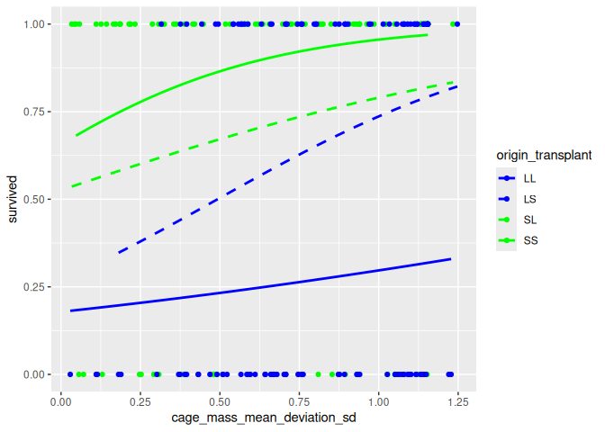
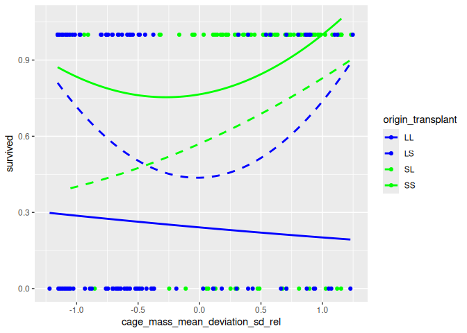

## Goal

In this document, the dialogue with the AI is described, including all
control questions. Of each question, the expected answer is calculated.

## Overview

The dialogue follows the skill levels of `[Spector & Ma, 2019]` in
increasing order:

<table>
<thead>
<tr class="header">
<th>Chapter</th>
<th>Ability</th>
<th>Description</th>
</tr>
</thead>
<tbody>
<tr class="odd">
<td>D1.1</td>
<td>Interpretation</td>
<td>Read the data</td>
</tr>
<tr class="even">
<td>D1.2</td>
<td>Explanation</td>
<td>Reproduce the data</td>
</tr>
<tr class="odd">
<td>D1.3</td>
<td>Reasoning</td>
<td>Reason about the data</td>
</tr>
<tr class="even">
<td>D1.4</td>
<td>Analysis</td>
<td>Work with the data</td>
</tr>
<tr class="odd">
<td>D1.5</td>
<td>Evaluation</td>
<td>Double-check progress</td>
</tr>
<tr class="even">
<td>D1.6</td>
<td>Synthesis</td>
<td>Combine data with research paper</td>
</tr>
<tr class="odd">
<td>D1.7</td>
<td>Reflection</td>
<td>Not applicable</td>
</tr>
<tr class="even">
<td>D2</td>
<td>Judgement</td>
<td>Ask Q1</td>
</tr>
<tr class="odd">
<td>D3.1</td>
<td>Analysis</td>
<td>Work with data</td>
</tr>
<tr class="even">
<td>D3.2</td>
<td>Evaluation</td>
<td>Double-check progress</td>
</tr>
<tr class="odd">
<td>D3.3</td>
<td>Synthesis</td>
<td>Combine data with alternative line of reasoning</td>
</tr>
<tr class="even">
<td>D3.4</td>
<td>Reflection</td>
<td>Not applicable</td>
</tr>
<tr class="odd">
<td>D4</td>
<td>Judgement</td>
<td>Ask Q2</td>
</tr>
</tbody>
</table>

## Expectations

A paper does not typically hold code (unlike an R Markdown document as
this one) and commonly all the results of an analysis are copy-pasted
into a paper and then left unchecked.

To make it easy to compare the final paper with the constants we’ve
copy-pasted, here are all the constants:

    ## Explain
    first_fish_id <- 181
    first_origin <- "Lake"
    first_transplant <- "Lake"
    first_pre_mass <- 1.00
    first_fish_survived <- 0
    first_enclosure_id <- "L1"

    ## Reasoning
    origin_values <- c("Lake", "Stream")
    transplanted_values <- c("Lake", "Stream", "Control")
    n_all_survived <- 151
    n_all_died <- 89
    n_all_ignored <- 60
    total_n_fish <- 300
    n_fish_control <- 60
    n_fish_transplanted <- 240
    lowest_pre_mass <- 0.5
    highest_pre_mass <- 3.6
    n_survived <- 151
    n_died <- 89
    n_enclosures <- 80
    n_enclosures_with_2_fish <- 3
    n_enclosures_with_3_fish <- 74
    n_enclosures_with_4_fish <- 3
    anomalous_enclosures <- c("L20", "L25", "L6", "L7", "S22", "S24")
    cage_mass_mean_for_l1 <- 1.256667
    cage_mass_stdev_for_l1 <- 0.4532475
    cage_mass_mean_deviation_sd_for_l1 <- c(1.1546303, -0.5662836, -0.5883466)

    abs_cage_mass_mean_deviation_sd_for_l1 <- abs(cage_mass_mean_deviation_sd_for_l1)

Here we check if our expectations are logically valid:

    library(testthat)

    # Check consistency between these variables
    expect_equal(
      total_n_fish,
      n_all_survived + n_all_died + n_all_ignored
    )

    expect_equal(
      total_n_fish,
      n_fish_control + n_fish_transplanted
    )
    expect_equal(
      n_fish_transplanted,
      n_survived + n_died
    )
    expect_equal(
      n_enclosures,
      n_enclosures_with_2_fish + n_enclosures_with_3_fish + n_enclosures_with_4_fish
    )
    expect_equal(
      length(anomalous_enclosures),
      n_enclosures_with_2_fish + n_enclosures_with_4_fish
    )

All solutions to the dialog are written here, and tested below, during
the dialogue.

To test this, the file with the data needs to be present in the working
folder:

    dataset_filename <- "Bolnick_traits.txt"
    if (!file.exists(dataset_filename)) {
      stop(
        "Dataset not found at path '", dataset_filename, "' \n",
        "Current working directory: ", getwd(), " \n"
      )
    }

## Helper functions

Here are some functions we need in the analysis:

    #' Determines if a value is TRUE. Is FALSE for NA
    is_true <- function(x) { !is.na(x) & x == TRUE  }
    expect_true(is_true(TRUE))
    expect_false(is_true(FALSE))
    expect_false(is_true(NA))

    #' Determines if a value is FALSE. Is FALSE for NA
    is_false <- function(x) { !is.na(x) & x == FALSE}
    expect_true(is_false(FALSE))
    expect_false(is_false(TRUE))
    expect_false(is_false(NA))

## D1. Teach an AI about the data and line of reasoning in the paper

These subsections are numbered by the abilities taught to the AI

### D1.1: Interpretation

In these steps, we let the AI read the data.

#### D1.1.1: Read data

-   The dialogue starts by uploading the data for the paper at
    [here](https://github.com/richelbilderbeek/Bolnick_and_Stutz_2017/blob/master/Bolnick_traits.txt).

<!-- -->

    t_all <- read.csv("Bolnick_traits.txt", sep = " ")

#### D1.1.2: Show first rows

Ask the AI:

    Could you show the first rows of the data?

Expected:

    knitr::kable(head(t_all))

<table>
<colgroup>
<col style="width: 7%" />
<col style="width: 5%" />
<col style="width: 5%" />
<col style="width: 8%" />
<col style="width: 8%" />
<col style="width: 7%" />
<col style="width: 7%" />
<col style="width: 8%" />
<col style="width: 8%" />
<col style="width: 9%" />
<col style="width: 2%" />
<col style="width: 2%" />
<col style="width: 2%" />
<col style="width: 3%" />
<col style="width: 3%" />
<col style="width: 3%" />
<col style="width: 7%" />
</colgroup>
<thead>
<tr class="header">
<th style="text-align: left;">sampleID</th>
<th style="text-align: right;">fishID</th>
<th style="text-align: left;">origin</th>
<th style="text-align: left;">enclosure</th>
<th style="text-align: left;">transplant</th>
<th style="text-align: left;">date_in</th>
<th style="text-align: right;">pre_mass</th>
<th style="text-align: right;">pre_length</th>
<th style="text-align: right;">post_mass</th>
<th style="text-align: right;">post_length</th>
<th style="text-align: right;">pw</th>
<th style="text-align: right;">bd</th>
<th style="text-align: right;">gw</th>
<th style="text-align: right;">grn</th>
<th style="text-align: right;">grl</th>
<th style="text-align: left;">sex</th>
<th style="text-align: right;">survived</th>
</tr>
</thead>
<tbody>
<tr class="odd">
<td style="text-align: left;">118</td>
<td style="text-align: right;">118</td>
<td style="text-align: left;">Stream</td>
<td style="text-align: left;">S2</td>
<td style="text-align: left;">Stream</td>
<td style="text-align: left;">06/03/11</td>
<td style="text-align: right;">1.75</td>
<td style="text-align: right;">4.9</td>
<td style="text-align: right;">NA</td>
<td style="text-align: right;">NA</td>
<td style="text-align: right;">NA</td>
<td style="text-align: right;">NA</td>
<td style="text-align: right;">NA</td>
<td style="text-align: right;">NA</td>
<td style="text-align: right;">NA</td>
<td style="text-align: left;">NA</td>
<td style="text-align: right;">0</td>
</tr>
<tr class="even">
<td style="text-align: left;">12</td>
<td style="text-align: right;">12</td>
<td style="text-align: left;">Stream</td>
<td style="text-align: left;">L8</td>
<td style="text-align: left;">Lake</td>
<td style="text-align: left;">06/02/11</td>
<td style="text-align: right;">1.13</td>
<td style="text-align: right;">4.6</td>
<td style="text-align: right;">NA</td>
<td style="text-align: right;">NA</td>
<td style="text-align: right;">NA</td>
<td style="text-align: right;">NA</td>
<td style="text-align: right;">NA</td>
<td style="text-align: right;">NA</td>
<td style="text-align: right;">NA</td>
<td style="text-align: left;">NA</td>
<td style="text-align: right;">0</td>
</tr>
<tr class="odd">
<td style="text-align: left;">122</td>
<td style="text-align: right;">122</td>
<td style="text-align: left;">Lake</td>
<td style="text-align: left;">S2</td>
<td style="text-align: left;">Stream</td>
<td style="text-align: left;">06/03/11</td>
<td style="text-align: right;">2.37</td>
<td style="text-align: right;">5.6</td>
<td style="text-align: right;">NA</td>
<td style="text-align: right;">NA</td>
<td style="text-align: right;">NA</td>
<td style="text-align: right;">NA</td>
<td style="text-align: right;">NA</td>
<td style="text-align: right;">NA</td>
<td style="text-align: right;">NA</td>
<td style="text-align: left;">NA</td>
<td style="text-align: right;">0</td>
</tr>
<tr class="even">
<td style="text-align: left;">123</td>
<td style="text-align: right;">123</td>
<td style="text-align: left;">Lake</td>
<td style="text-align: left;">S3</td>
<td style="text-align: left;">Stream</td>
<td style="text-align: left;">06/03/11</td>
<td style="text-align: right;">1.71</td>
<td style="text-align: right;">5.2</td>
<td style="text-align: right;">NA</td>
<td style="text-align: right;">NA</td>
<td style="text-align: right;">NA</td>
<td style="text-align: right;">NA</td>
<td style="text-align: right;">NA</td>
<td style="text-align: right;">NA</td>
<td style="text-align: right;">NA</td>
<td style="text-align: left;">NA</td>
<td style="text-align: right;">0</td>
</tr>
<tr class="odd">
<td style="text-align: left;">124</td>
<td style="text-align: right;">124</td>
<td style="text-align: left;">Lake</td>
<td style="text-align: left;">S4</td>
<td style="text-align: left;">Stream</td>
<td style="text-align: left;">06/03/11</td>
<td style="text-align: right;">2.45</td>
<td style="text-align: right;">5.4</td>
<td style="text-align: right;">NA</td>
<td style="text-align: right;">NA</td>
<td style="text-align: right;">NA</td>
<td style="text-align: right;">NA</td>
<td style="text-align: right;">NA</td>
<td style="text-align: right;">NA</td>
<td style="text-align: right;">NA</td>
<td style="text-align: left;">NA</td>
<td style="text-align: right;">0</td>
</tr>
<tr class="even">
<td style="text-align: left;">127</td>
<td style="text-align: right;">127</td>
<td style="text-align: left;">Lake</td>
<td style="text-align: left;">S7</td>
<td style="text-align: left;">Stream</td>
<td style="text-align: left;">06/03/11</td>
<td style="text-align: right;">0.85</td>
<td style="text-align: right;">4.0</td>
<td style="text-align: right;">NA</td>
<td style="text-align: right;">NA</td>
<td style="text-align: right;">NA</td>
<td style="text-align: right;">NA</td>
<td style="text-align: right;">NA</td>
<td style="text-align: right;">NA</td>
<td style="text-align: right;">NA</td>
<td style="text-align: left;">NA</td>
<td style="text-align: right;">0</td>
</tr>
</tbody>
</table>

We select only the relevant data here, so that the analysis can be
checked by humans more easily:

    t <- t_all |> 
      dplyr::select(
        fishID, 
        origin, 
        enclosure, 
        pre_mass, 
        transplant,  
        survived
      ) |> dplyr::arrange(enclosure)
    knitr::kable(head(t))

<table>
<thead>
<tr class="header">
<th style="text-align: left;"></th>
<th style="text-align: right;">fishID</th>
<th style="text-align: left;">origin</th>
<th style="text-align: left;">enclosure</th>
<th style="text-align: right;">pre_mass</th>
<th style="text-align: left;">transplant</th>
<th style="text-align: right;">survived</th>
</tr>
</thead>
<tbody>
<tr class="odd">
<td style="text-align: left;">27</td>
<td style="text-align: right;">181</td>
<td style="text-align: left;">Lake</td>
<td style="text-align: left;">L1</td>
<td style="text-align: right;">1.00</td>
<td style="text-align: left;">Lake</td>
<td style="text-align: right;">0</td>
</tr>
<tr class="even">
<td style="text-align: left;">28</td>
<td style="text-align: right;">182</td>
<td style="text-align: left;">Lake</td>
<td style="text-align: left;">L1</td>
<td style="text-align: right;">0.99</td>
<td style="text-align: left;">Lake</td>
<td style="text-align: right;">0</td>
</tr>
<tr class="odd">
<td style="text-align: left;">149</td>
<td style="text-align: right;">1</td>
<td style="text-align: left;">Stream</td>
<td style="text-align: left;">L1</td>
<td style="text-align: right;">1.78</td>
<td style="text-align: left;">Lake</td>
<td style="text-align: right;">1</td>
</tr>
<tr class="even">
<td style="text-align: left;">16</td>
<td style="text-align: right;">16</td>
<td style="text-align: left;">Stream</td>
<td style="text-align: left;">L10</td>
<td style="text-align: right;">1.22</td>
<td style="text-align: left;">Lake</td>
<td style="text-align: right;">0</td>
</tr>
<tr class="odd">
<td style="text-align: left;">36</td>
<td style="text-align: right;">193</td>
<td style="text-align: left;">Lake</td>
<td style="text-align: left;">L10</td>
<td style="text-align: right;">1.71</td>
<td style="text-align: left;">Lake</td>
<td style="text-align: right;">0</td>
</tr>
<tr class="even">
<td style="text-align: left;">164</td>
<td style="text-align: right;">17</td>
<td style="text-align: left;">Stream</td>
<td style="text-align: left;">L10</td>
<td style="text-align: right;">2.06</td>
<td style="text-align: left;">Lake</td>
<td style="text-align: right;">1</td>
</tr>
</tbody>
</table>

### D1.2: Explanation

In these steps, we let the AI demonstrate it has read the data.

#### D1.2.1: Explain ‘fishID’

Ask the AI:

    The 'fishID' column denotes the ID of a fish.
    Each fish has a unique ID.
    Could you give me the ID of the first fish in the dataset?

Expected:

    expect_equal(t$fishID[1], first_fish_id)

The expected answer is 181.

#### D1.2.2: Explain ‘origin’

Ask the AI:

    The 'origin' column denotes the location where each fish comes from.
    What is the location the first fish came from?

Expected:

    expect_equal(first_origin, t$origin[1])

The correct answers is Lake.

#### D1.2.3: Explain ‘transplant’ values

Ask the AI:

    The 'transplant' column denotes the location where each fish is
    transplanted to.
    A value of 'Stream' denotes that the fish is part of the experiment
    and is translated to a stream.
    A value of 'Lake' denotes that the fish is part of the experiment
    and is translated to a lake.
    A value of 'Control' denotes that this fish was not part of the experiment
    and was part of the control group instead.
    What is the locations the first fish is transplanted to?

Expected:

    expect_equal(t$transplant[1], first_transplant)

The correct answers is Lake.

#### D1.2.4: Explain ‘pre\_mass’

Ask the AI:

    The `pre_mass` column denotes the mass of a fish
    before the transplantation.
    A value of 'NA' denotes that the fish has not been weighted
    before transplantation.

    About the first fish: has it been weighted before transplantation?
    If yes, what is its mass before transplantation? 

Expected:

    expect_equal(t$pre_mass[1], first_pre_mass)

The correct answer is 0.5 to 3.6.

#### D1.2.5: Explain ‘survived’

Ask the AI:

    The `survived` column denotes if the fish survived the experiment.
    A value of 0 means that the fish died in the experiment.
    A value of 1 means that the fish survived the experiment.
    A value of NA means that the fish was irrevant to the experiment.

Expected:

    expect_equal(t$survived[1], first_fish_survived)

The correct answers is 0.

#### D1.2.6: Explain ‘enclosure’

Ask the AI:

    The `enclosure` column denotes the ID of an enclosure.
    Each enclose has a unique ID.
    What is the ID of the first enclosure?

Expected:

    expect_equal(t$enclosure[1], first_enclosure_id)

The correct answer is L1.

### D1.3: Reasoning

In these steps, we let the AI reason about the data, such as producing a
tally.

#### D1.3.1: Reason about the ‘fishID’ values

Ask the AI:

    How many different fish are in this dataset?

Expected:

    expect_equal(total_n_fish, length(unique(t$fishID)))

The expected answer is 300.

#### D1.3.2: Reason about the ‘origin’ values

Ask the AI:

    What are the locations the fish come from?

Expected:

    expect_equal(unique(t$origin), origin_values)

The correct answers is Lake, Stream.

#### D1.3.3: Reason about ‘transplant’: count the fish in experiment

Ask the AI:

    How many fish are part of the experiment?

Expected:

    t_1 <- t |> dplyr::filter(transplant != "Control") 
    expect_equal(n_fish_transplanted, length(unique(t_1$fishID)))

The correct answer is 240.

#### D1.3.4: Reason about the ‘pre\_mass’ values

Ask the AI:

    What is lowest fish mass before transplantation?
    What is heighest fish mass before transplantation?

Expected:

    expect_equal(lowest_pre_mass, min(t_1$pre_mass))
    expect_equal(highest_pre_mass, max(t_1$pre_mass))

The correct answer is 0.5 to 3.6.

#### D1.3.5: Reason with ‘survived’: count the survivors

Ask the AI:

    How many fish died?
    How many fish survived?
    How many fish were not part of the experiment?

Expected:

    expect_equal(n_all_survived, sum(is_true(t$survived)))
    expect_equal(n_all_died, sum(is_false(t$survived)))
    expect_equal(n_all_ignored, sum(is.na(t$survived)))

The correct answers are:

-   89 fish died
-   151 fish survived
-   60 fish were not part of the experiment?

#### D1.3.6.1: Reason about the ‘enclosure’ values: count the nub

Ask the AI:

    How many enclosures are used in the experiment?

Expected:

    expect_equal(n_enclosures, length(unique(t_1$enclosure)))

The correct answer is 80 enclosures.

#### D1.3.6.2: Reasom about ‘enclosure’: tally the number of fish

Ask the AI:

    How many fish, that are part of the experiment, are in each enclosure?

Expected:

    t_1 <- t |> dplyr::filter(transplant != "Control") 
    n_fish_per_enclosure <- dplyr::count(t_1, enclosure)
    expect_equal(n_enclosures_with_2_fish, sum(n_fish_per_enclosure$n == 2))
    expect_equal(n_enclosures_with_3_fish, sum(n_fish_per_enclosure$n == 3))
    expect_equal(n_enclosures_with_4_fish, sum(n_fish_per_enclosure$n == 4))
    knitr::kable(head(n_fish_per_enclosure))

<table>
<thead>
<tr class="header">
<th style="text-align: left;">enclosure</th>
<th style="text-align: right;">n</th>
</tr>
</thead>
<tbody>
<tr class="odd">
<td style="text-align: left;">L1</td>
<td style="text-align: right;">3</td>
</tr>
<tr class="even">
<td style="text-align: left;">L10</td>
<td style="text-align: right;">3</td>
</tr>
<tr class="odd">
<td style="text-align: left;">L11</td>
<td style="text-align: right;">3</td>
</tr>
<tr class="even">
<td style="text-align: left;">L12</td>
<td style="text-align: right;">3</td>
</tr>
<tr class="odd">
<td style="text-align: left;">L13</td>
<td style="text-align: right;">3</td>
</tr>
<tr class="even">
<td style="text-align: left;">L14</td>
<td style="text-align: right;">3</td>
</tr>
</tbody>
</table>

The correct answer is:

-   3 enclosures have 2 fish
-   74 enclosures have 3 fish
-   3 enclosures have 4 fish

As a note to self, these are the anomalies:

    expect_equal(anomalous_enclosures, n_fish_per_enclosure[n_fish_per_enclosure$n != 3, ]$enclosure)
    knitr::kable(n_fish_per_enclosure[n_fish_per_enclosure$n != 3, ])

<table>
<thead>
<tr class="header">
<th style="text-align: left;"></th>
<th style="text-align: left;">enclosure</th>
<th style="text-align: right;">n</th>
</tr>
</thead>
<tbody>
<tr class="odd">
<td style="text-align: left;">13</td>
<td style="text-align: left;">L20</td>
<td style="text-align: right;">4</td>
</tr>
<tr class="even">
<td style="text-align: left;">18</td>
<td style="text-align: left;">L25</td>
<td style="text-align: right;">2</td>
</tr>
<tr class="odd">
<td style="text-align: left;">37</td>
<td style="text-align: left;">L6</td>
<td style="text-align: right;">2</td>
</tr>
<tr class="even">
<td style="text-align: left;">38</td>
<td style="text-align: left;">L7</td>
<td style="text-align: right;">4</td>
</tr>
<tr class="odd">
<td style="text-align: left;">55</td>
<td style="text-align: left;">S22</td>
<td style="text-align: right;">4</td>
</tr>
<tr class="even">
<td style="text-align: left;">57</td>
<td style="text-align: left;">S24</td>
<td style="text-align: right;">2</td>
</tr>
</tbody>
</table>

### D1.4: Analysis

In these steps, we work with the data, in the same way as the paper did.

#### D1.4.1: calculate ‘cage\_mass\_mean’

Ask the AI:

    To make a better comparison, we are going to standarize
    body masses per enclosure.
    Add a column to the
    data called `cage_mass_mean` which holds the average
    `pre_mass` within the enclosure each fish is in.
    Could you show me the data for enclosure L1?

Expected:

    cage_mass_mean_per_enclosure <- t_1 |> 
      dplyr::select(enclosure, pre_mass) |>
      dplyr::group_by(enclosure) |>
      dplyr::summarise(cage_mass_mean = mean(pre_mass))
    t_2 <- merge(t_1, cage_mass_mean_per_enclosure)
    knitr::kable(head(t_2))

<table style="width:100%;">
<colgroup>
<col style="width: 14%" />
<col style="width: 10%" />
<col style="width: 10%" />
<col style="width: 13%" />
<col style="width: 16%" />
<col style="width: 13%" />
<col style="width: 22%" />
</colgroup>
<thead>
<tr class="header">
<th style="text-align: left;">enclosure</th>
<th style="text-align: right;">fishID</th>
<th style="text-align: left;">origin</th>
<th style="text-align: right;">pre_mass</th>
<th style="text-align: left;">transplant</th>
<th style="text-align: right;">survived</th>
<th style="text-align: right;">cage_mass_mean</th>
</tr>
</thead>
<tbody>
<tr class="odd">
<td style="text-align: left;">L1</td>
<td style="text-align: right;">181</td>
<td style="text-align: left;">Lake</td>
<td style="text-align: right;">1.00</td>
<td style="text-align: left;">Lake</td>
<td style="text-align: right;">0</td>
<td style="text-align: right;">1.256667</td>
</tr>
<tr class="even">
<td style="text-align: left;">L1</td>
<td style="text-align: right;">182</td>
<td style="text-align: left;">Lake</td>
<td style="text-align: right;">0.99</td>
<td style="text-align: left;">Lake</td>
<td style="text-align: right;">0</td>
<td style="text-align: right;">1.256667</td>
</tr>
<tr class="odd">
<td style="text-align: left;">L1</td>
<td style="text-align: right;">1</td>
<td style="text-align: left;">Stream</td>
<td style="text-align: right;">1.78</td>
<td style="text-align: left;">Lake</td>
<td style="text-align: right;">1</td>
<td style="text-align: right;">1.256667</td>
</tr>
<tr class="even">
<td style="text-align: left;">L10</td>
<td style="text-align: right;">16</td>
<td style="text-align: left;">Stream</td>
<td style="text-align: right;">1.22</td>
<td style="text-align: left;">Lake</td>
<td style="text-align: right;">0</td>
<td style="text-align: right;">1.663333</td>
</tr>
<tr class="odd">
<td style="text-align: left;">L10</td>
<td style="text-align: right;">193</td>
<td style="text-align: left;">Lake</td>
<td style="text-align: right;">1.71</td>
<td style="text-align: left;">Lake</td>
<td style="text-align: right;">0</td>
<td style="text-align: right;">1.663333</td>
</tr>
<tr class="even">
<td style="text-align: left;">L10</td>
<td style="text-align: right;">17</td>
<td style="text-align: left;">Stream</td>
<td style="text-align: right;">2.06</td>
<td style="text-align: left;">Lake</td>
<td style="text-align: right;">1</td>
<td style="text-align: right;">1.663333</td>
</tr>
</tbody>
</table>

    knitr::kable(t_2[t_2$enclosure == "L1", ])

<table style="width:100%;">
<colgroup>
<col style="width: 14%" />
<col style="width: 10%" />
<col style="width: 10%" />
<col style="width: 13%" />
<col style="width: 16%" />
<col style="width: 13%" />
<col style="width: 22%" />
</colgroup>
<thead>
<tr class="header">
<th style="text-align: left;">enclosure</th>
<th style="text-align: right;">fishID</th>
<th style="text-align: left;">origin</th>
<th style="text-align: right;">pre_mass</th>
<th style="text-align: left;">transplant</th>
<th style="text-align: right;">survived</th>
<th style="text-align: right;">cage_mass_mean</th>
</tr>
</thead>
<tbody>
<tr class="odd">
<td style="text-align: left;">L1</td>
<td style="text-align: right;">181</td>
<td style="text-align: left;">Lake</td>
<td style="text-align: right;">1.00</td>
<td style="text-align: left;">Lake</td>
<td style="text-align: right;">0</td>
<td style="text-align: right;">1.256667</td>
</tr>
<tr class="even">
<td style="text-align: left;">L1</td>
<td style="text-align: right;">182</td>
<td style="text-align: left;">Lake</td>
<td style="text-align: right;">0.99</td>
<td style="text-align: left;">Lake</td>
<td style="text-align: right;">0</td>
<td style="text-align: right;">1.256667</td>
</tr>
<tr class="odd">
<td style="text-align: left;">L1</td>
<td style="text-align: right;">1</td>
<td style="text-align: left;">Stream</td>
<td style="text-align: right;">1.78</td>
<td style="text-align: left;">Lake</td>
<td style="text-align: right;">1</td>
<td style="text-align: right;">1.256667</td>
</tr>
</tbody>
</table>

    expect_equal(
      t_2[t_2$enclosure == "L1", ]$cage_mass_mean,
      rep(cage_mass_mean_for_l1, 3),
      tolerance = 1.0e-6
    )

For enclose L1, the expected `cage_mass_mean` for each of the fish is
1.256667.

#### D1.4.2: calculate ‘cage\_mass\_stdev’

Ask the AI:

    To make a better comparison, we are going to standarize
    body masses per enclosure. Add a column to the
    data called `cage_mass_stdev` which is the standard
    deviation of the `pre_mass` distribution of each enclosure
    each fish is in.
    Could you show me the data for enclosure L1?

Expected:

    cage_mass_stdev_per_enclosure <- t_2 |> 
      dplyr::select(enclosure, pre_mass) |>
      dplyr::group_by(enclosure) |>
      dplyr::summarise(cage_mass_stdev = sd(pre_mass))
    t_3 <- merge(t_2, cage_mass_stdev_per_enclosure)
    knitr::kable(head(t_3))

<table>
<colgroup>
<col style="width: 11%" />
<col style="width: 8%" />
<col style="width: 8%" />
<col style="width: 10%" />
<col style="width: 13%" />
<col style="width: 10%" />
<col style="width: 17%" />
<col style="width: 19%" />
</colgroup>
<thead>
<tr class="header">
<th style="text-align: left;">enclosure</th>
<th style="text-align: right;">fishID</th>
<th style="text-align: left;">origin</th>
<th style="text-align: right;">pre_mass</th>
<th style="text-align: left;">transplant</th>
<th style="text-align: right;">survived</th>
<th style="text-align: right;">cage_mass_mean</th>
<th style="text-align: right;">cage_mass_stdev</th>
</tr>
</thead>
<tbody>
<tr class="odd">
<td style="text-align: left;">L1</td>
<td style="text-align: right;">181</td>
<td style="text-align: left;">Lake</td>
<td style="text-align: right;">1.00</td>
<td style="text-align: left;">Lake</td>
<td style="text-align: right;">0</td>
<td style="text-align: right;">1.256667</td>
<td style="text-align: right;">0.4532475</td>
</tr>
<tr class="even">
<td style="text-align: left;">L1</td>
<td style="text-align: right;">182</td>
<td style="text-align: left;">Lake</td>
<td style="text-align: right;">0.99</td>
<td style="text-align: left;">Lake</td>
<td style="text-align: right;">0</td>
<td style="text-align: right;">1.256667</td>
<td style="text-align: right;">0.4532475</td>
</tr>
<tr class="odd">
<td style="text-align: left;">L1</td>
<td style="text-align: right;">1</td>
<td style="text-align: left;">Stream</td>
<td style="text-align: right;">1.78</td>
<td style="text-align: left;">Lake</td>
<td style="text-align: right;">1</td>
<td style="text-align: right;">1.256667</td>
<td style="text-align: right;">0.4532475</td>
</tr>
<tr class="even">
<td style="text-align: left;">L10</td>
<td style="text-align: right;">16</td>
<td style="text-align: left;">Stream</td>
<td style="text-align: right;">1.22</td>
<td style="text-align: left;">Lake</td>
<td style="text-align: right;">0</td>
<td style="text-align: right;">1.663333</td>
<td style="text-align: right;">0.4219400</td>
</tr>
<tr class="odd">
<td style="text-align: left;">L10</td>
<td style="text-align: right;">193</td>
<td style="text-align: left;">Lake</td>
<td style="text-align: right;">1.71</td>
<td style="text-align: left;">Lake</td>
<td style="text-align: right;">0</td>
<td style="text-align: right;">1.663333</td>
<td style="text-align: right;">0.4219400</td>
</tr>
<tr class="even">
<td style="text-align: left;">L10</td>
<td style="text-align: right;">17</td>
<td style="text-align: left;">Stream</td>
<td style="text-align: right;">2.06</td>
<td style="text-align: left;">Lake</td>
<td style="text-align: right;">1</td>
<td style="text-align: right;">1.663333</td>
<td style="text-align: right;">0.4219400</td>
</tr>
</tbody>
</table>

    knitr::kable(t_3[t_3$enclosure == "L1", ])

<table>
<colgroup>
<col style="width: 11%" />
<col style="width: 8%" />
<col style="width: 8%" />
<col style="width: 10%" />
<col style="width: 13%" />
<col style="width: 10%" />
<col style="width: 17%" />
<col style="width: 19%" />
</colgroup>
<thead>
<tr class="header">
<th style="text-align: left;">enclosure</th>
<th style="text-align: right;">fishID</th>
<th style="text-align: left;">origin</th>
<th style="text-align: right;">pre_mass</th>
<th style="text-align: left;">transplant</th>
<th style="text-align: right;">survived</th>
<th style="text-align: right;">cage_mass_mean</th>
<th style="text-align: right;">cage_mass_stdev</th>
</tr>
</thead>
<tbody>
<tr class="odd">
<td style="text-align: left;">L1</td>
<td style="text-align: right;">181</td>
<td style="text-align: left;">Lake</td>
<td style="text-align: right;">1.00</td>
<td style="text-align: left;">Lake</td>
<td style="text-align: right;">0</td>
<td style="text-align: right;">1.256667</td>
<td style="text-align: right;">0.4532475</td>
</tr>
<tr class="even">
<td style="text-align: left;">L1</td>
<td style="text-align: right;">182</td>
<td style="text-align: left;">Lake</td>
<td style="text-align: right;">0.99</td>
<td style="text-align: left;">Lake</td>
<td style="text-align: right;">0</td>
<td style="text-align: right;">1.256667</td>
<td style="text-align: right;">0.4532475</td>
</tr>
<tr class="odd">
<td style="text-align: left;">L1</td>
<td style="text-align: right;">1</td>
<td style="text-align: left;">Stream</td>
<td style="text-align: right;">1.78</td>
<td style="text-align: left;">Lake</td>
<td style="text-align: right;">1</td>
<td style="text-align: right;">1.256667</td>
<td style="text-align: right;">0.4532475</td>
</tr>
</tbody>
</table>

    expect_equal(
      t_3[t_3$enclosure == "L1", ]$cage_mass_stdev,
      rep(cage_mass_stdev_for_l1, 3),
      tolerance = 1.0e-6
    )

#### D1.4.3: calculate ‘cage\_mass\_mean\_deviation\_sd’

Ask the AI:

    To make a better comparison, we are going to standarize
    body masses per enclosure. Add a column to the
    data called `cage_mass_mean_deviation_sd`.
    Its values are calculated per fish.
    Each fish its `cage_mass_mean_deviation_sd`
    equals the absolute difference between its `pre_mass`
    and its enclosure's `cage_mass_mean`, 
    divided by the `cage_mass_stdev` of its enclosure.
    Could you show me the data for enclosure L1?

Expected:

    cage_mass_mean_deviation_sd_per_fish <- t_3 |> 
      dplyr::select(fishID, pre_mass, cage_mass_mean, cage_mass_stdev) |>
      dplyr::group_by(fishID) |>
      dplyr::mutate(
        cage_mass_mean_deviation_sd = 
          abs(pre_mass - cage_mass_mean) / cage_mass_stdev
      ) |>
      dplyr::select(fishID, cage_mass_mean_deviation_sd)
    expect_equal(
      nrow(cage_mass_mean_deviation_sd_per_fish),
      n_fish_transplanted
    )

    expect_equal(
      nrow(t_3),
      n_fish_transplanted
    )
    t_4 <- merge(t_3, cage_mass_mean_deviation_sd_per_fish)
    expect_equal(
      nrow(t_4),
      n_fish_transplanted
    )

    knitr::kable(head(t_4))

<table>
<colgroup>
<col style="width: 6%" />
<col style="width: 8%" />
<col style="width: 6%" />
<col style="width: 8%" />
<col style="width: 9%" />
<col style="width: 8%" />
<col style="width: 13%" />
<col style="width: 14%" />
<col style="width: 25%" />
</colgroup>
<thead>
<tr class="header">
<th style="text-align: right;">fishID</th>
<th style="text-align: left;">enclosure</th>
<th style="text-align: left;">origin</th>
<th style="text-align: right;">pre_mass</th>
<th style="text-align: left;">transplant</th>
<th style="text-align: right;">survived</th>
<th style="text-align: right;">cage_mass_mean</th>
<th style="text-align: right;">cage_mass_stdev</th>
<th style="text-align: right;">cage_mass_mean_deviation_sd</th>
</tr>
</thead>
<tbody>
<tr class="odd">
<td style="text-align: right;">1</td>
<td style="text-align: left;">L1</td>
<td style="text-align: left;">Stream</td>
<td style="text-align: right;">1.78</td>
<td style="text-align: left;">Lake</td>
<td style="text-align: right;">1</td>
<td style="text-align: right;">1.256667</td>
<td style="text-align: right;">0.4532475</td>
<td style="text-align: right;">1.1546303</td>
</tr>
<tr class="even">
<td style="text-align: right;">2</td>
<td style="text-align: left;">L2</td>
<td style="text-align: left;">Stream</td>
<td style="text-align: right;">0.65</td>
<td style="text-align: left;">Lake</td>
<td style="text-align: right;">1</td>
<td style="text-align: right;">1.016667</td>
<td style="text-align: right;">0.5589574</td>
<td style="text-align: right;">0.6559832</td>
</tr>
<tr class="odd">
<td style="text-align: right;">3</td>
<td style="text-align: left;">L2</td>
<td style="text-align: left;">Stream</td>
<td style="text-align: right;">1.66</td>
<td style="text-align: left;">Lake</td>
<td style="text-align: right;">1</td>
<td style="text-align: right;">1.016667</td>
<td style="text-align: right;">0.5589574</td>
<td style="text-align: right;">1.1509524</td>
</tr>
<tr class="even">
<td style="text-align: right;">4</td>
<td style="text-align: left;">L3</td>
<td style="text-align: left;">Stream</td>
<td style="text-align: right;">2.26</td>
<td style="text-align: left;">Lake</td>
<td style="text-align: right;">1</td>
<td style="text-align: right;">1.453333</td>
<td style="text-align: right;">0.8309834</td>
<td style="text-align: right;">0.9707375</td>
</tr>
<tr class="odd">
<td style="text-align: right;">5</td>
<td style="text-align: left;">L3</td>
<td style="text-align: left;">Stream</td>
<td style="text-align: right;">1.50</td>
<td style="text-align: left;">Lake</td>
<td style="text-align: right;">0</td>
<td style="text-align: right;">1.453333</td>
<td style="text-align: right;">0.8309834</td>
<td style="text-align: right;">0.0561584</td>
</tr>
<tr class="even">
<td style="text-align: right;">6</td>
<td style="text-align: left;">L4</td>
<td style="text-align: left;">Stream</td>
<td style="text-align: right;">1.89</td>
<td style="text-align: left;">Lake</td>
<td style="text-align: right;">1</td>
<td style="text-align: right;">1.723333</td>
<td style="text-align: right;">0.9016282</td>
<td style="text-align: right;">0.1848508</td>
</tr>
</tbody>
</table>

    knitr::kable(t_4[t_4$enclosure == "L1", ])

<table>
<colgroup>
<col style="width: 3%" />
<col style="width: 6%" />
<col style="width: 8%" />
<col style="width: 6%" />
<col style="width: 7%" />
<col style="width: 9%" />
<col style="width: 7%" />
<col style="width: 12%" />
<col style="width: 13%" />
<col style="width: 24%" />
</colgroup>
<thead>
<tr class="header">
<th style="text-align: left;"></th>
<th style="text-align: right;">fishID</th>
<th style="text-align: left;">enclosure</th>
<th style="text-align: left;">origin</th>
<th style="text-align: right;">pre_mass</th>
<th style="text-align: left;">transplant</th>
<th style="text-align: right;">survived</th>
<th style="text-align: right;">cage_mass_mean</th>
<th style="text-align: right;">cage_mass_stdev</th>
<th style="text-align: right;">cage_mass_mean_deviation_sd</th>
</tr>
</thead>
<tbody>
<tr class="odd">
<td style="text-align: left;">1</td>
<td style="text-align: right;">1</td>
<td style="text-align: left;">L1</td>
<td style="text-align: left;">Stream</td>
<td style="text-align: right;">1.78</td>
<td style="text-align: left;">Lake</td>
<td style="text-align: right;">1</td>
<td style="text-align: right;">1.256667</td>
<td style="text-align: right;">0.4532475</td>
<td style="text-align: right;">1.1546303</td>
</tr>
<tr class="even">
<td style="text-align: left;">181</td>
<td style="text-align: right;">181</td>
<td style="text-align: left;">L1</td>
<td style="text-align: left;">Lake</td>
<td style="text-align: right;">1.00</td>
<td style="text-align: left;">Lake</td>
<td style="text-align: right;">0</td>
<td style="text-align: right;">1.256667</td>
<td style="text-align: right;">0.4532475</td>
<td style="text-align: right;">0.5662836</td>
</tr>
<tr class="odd">
<td style="text-align: left;">182</td>
<td style="text-align: right;">182</td>
<td style="text-align: left;">L1</td>
<td style="text-align: left;">Lake</td>
<td style="text-align: right;">0.99</td>
<td style="text-align: left;">Lake</td>
<td style="text-align: right;">0</td>
<td style="text-align: right;">1.256667</td>
<td style="text-align: right;">0.4532475</td>
<td style="text-align: right;">0.5883466</td>
</tr>
</tbody>
</table>

    expect_equal(
      t_4[t_4$enclosure == "L1", ]$cage_mass_mean_deviation_sd,
      abs_cage_mass_mean_deviation_sd_for_l1,
      tolerance = 1.0e-6
    )

The values of `cage_mass_mean_deviation_sd` for enclosure `L1` are
expected to be 1.1546303, 0.5662836, 0.5883466.

### D1.5: Evaluation

The AI has been evaluated each step along the way. Regardless of this,
here we evaluate the learning of the AI again, in a more visual way: it
should reproduce a figure in the paper.

#### D1.5.1: reproduce the plot

Ask the AI:

    Create a scatter plot of this data:
    - Each point is a fish. 
    - Use a blue color for fish
      that have 'Lake' as their origin.
    - Use a green color for fish
      that have 'Stream' as their origin.
    - On the X axis, put the values of `cage_mass_mean_deviation_sd`
      of each fish
    - On the Y axis, put the `survived` of each fish.
    - Put the fish in four categories:
      - Fish that have an `origin` of 'Lake' and
        a `transplant` of 'Lake' are in category 'LL'
      - Fish that have an `origin` of 'Lake' and
        a `transplant` of 'Stream' are in category 'LS'
      - Fish that have an `origin` of 'Stream' and
        a `transplant` of 'Lake' are in category 'SL'
      - Fish that have an `origin` of 'Stream' and
        a `transplant` of 'Stream' are in category 'SS'
    - Show a trendline for each binomal fit on each of these 4 categories.
      - Use blue lines for categories that originate from a lake
      - Use green lines for categories that originate from a stream
      - Use solid lines for categories 'LL' and 'SS'
      - Use dashed lines for categories 'LS' and 'SL'

Expected is the plot in the paper:

    t_4$origin_transplant <- paste0(
      stringr::str_sub(t_4$origin,1 ,1),
      stringr::str_sub(t_4$transplant,1 ,1)
    )
    ggplot2::ggplot(
      data = t_4,
      ggplot2::aes(
        x = cage_mass_mean_deviation_sd,
        y = survived,
        color = origin_transplant,
        lty = origin_transplant
      )
    ) + ggplot2::scale_color_manual(
        values = c("blue", "blue", "green", "green")
      ) + 
      ggplot2::scale_linetype_manual(
        values = c("solid", "dashed", "dashed", "solid")
      ) +
      ggplot2::geom_point() +
      ggplot2::geom_smooth(
        method = "glm",
        method.args = list(family = "binomial"),
        se = FALSE
      )
    #> `geom_smooth()` using formula = 'y ~ x'

### D1.6: Synthesis

In these steps, we are combining the current knowledge with the paper.

Tell the AI:

    The data you've been working on was used in a scientific paper.
    The analyis you've done so far was used in the same scientific paper.
    Below this paragraph is the abstract of that scientific paper.
    Read it.

    Two distinct forms of natural selection promote adaptive biological
    diversity. Divergent selection occurs when different environments
    favour different phenotypes, leading to increased differences
    between populations. Negative frequency-dependent selection
    occurs when rare variants within a population are favoured over
    common ones, increasing diversity within populations. These
    two diversifying forces promote genetic variation at different
    spatial scales, and may act in opposition, but their relative effects
    remain unclear because they are rarely measured concurrently.
    Here we show that negative frequency-dependent selection within
    populations can favor rare immigrants over locally adapted
    residents. We reciprocally transplanted lake and stream ecotypes
    of threespine stickleback into lake and stream habitats, while
    manipulating the relative abundance of residents versus immigrants.
    We found negative frequency-dependence: survival was highest
    for the locally rare ecotype, rather than natives. Also, individuals
    with locally rare major histocompatibility complex (MHC) class
    IIb genotypes were infected by fewer parasites. This negative
    frequency-dependent selection will tend to favour rare immigrants
    over common residents, amplifying the effect of migration and
    undermining the efficacy of divergent natural selection to drive
    population differences. The only signal of divergent selection
    was a tendency for foreign fish to have higher parasite loads than
    residents, after controlling for MHC genotype rarity. Frequency-
    dependent ecological interactions have long been thought to
    promote speciation. Our results suggest a more nuanced view in
    which negative frequency dependence alters the fate of migrants to
    promote or constrain evolutionary divergence between populations.

### D1.7: Reflection

Not applicable. A trained AI does not need to reflect on its learning.

## D2. **Q1**: Ask if the conclusion is correct

Ask the AI:

    The scientific paper describes a conclusion drawn from the data.
    The conclusion is that the extreme body masses
    are likelier to survive.
    Do you judge this to be a valid conclusion based on the data?

## D3 Alternative line of reasoning

### D3.1 Analysis

#### D3.1.1 Add relative standarized body mass

Ask the AI:

    To make a better comparison, we are going to standarize
    body masses per enclosure. Add a column to the
    data called `cage_mass_mean_deviation_sd_rel`.
    Its values are calculated per fish.
    Each fish its `cage_mass_mean_deviation_sd_rel`
    equals the difference between its `pre_mass`
    and its enclosure's `cage_mass_mean`, 
    divided by the `cage_mass_stdev` of its enclosure.
    Could you show me the data for enclosure L1?

Expected:

    cage_mass_mean_deviation_sd_per_fish_rel <- t_4 |> 
      dplyr::select(fishID, pre_mass, cage_mass_mean, cage_mass_stdev) |>
      dplyr::group_by(fishID) |>
      dplyr::mutate(
        cage_mass_mean_deviation_sd_rel = 
          (pre_mass - cage_mass_mean) / cage_mass_stdev
      ) |>
      dplyr::select(fishID, cage_mass_mean_deviation_sd_rel)
    expect_equal(
      nrow(cage_mass_mean_deviation_sd_per_fish_rel),
      n_fish_transplanted
    )

    expect_equal(
      nrow(t_4),
      n_fish_transplanted
    )
    t_5 <- merge(t_4, cage_mass_mean_deviation_sd_per_fish_rel)
    expect_equal(
      nrow(t_5),
      n_fish_transplanted
    )

    knitr::kable(head(t_5))

<table>
<colgroup>
<col style="width: 4%" />
<col style="width: 6%" />
<col style="width: 4%" />
<col style="width: 5%" />
<col style="width: 6%" />
<col style="width: 5%" />
<col style="width: 9%" />
<col style="width: 9%" />
<col style="width: 17%" />
<col style="width: 11%" />
<col style="width: 19%" />
</colgroup>
<thead>
<tr class="header">
<th style="text-align: right;">fishID</th>
<th style="text-align: left;">enclosure</th>
<th style="text-align: left;">origin</th>
<th style="text-align: right;">pre_mass</th>
<th style="text-align: left;">transplant</th>
<th style="text-align: right;">survived</th>
<th style="text-align: right;">cage_mass_mean</th>
<th style="text-align: right;">cage_mass_stdev</th>
<th style="text-align: right;">cage_mass_mean_deviation_sd</th>
<th style="text-align: left;">origin_transplant</th>
<th style="text-align: right;">cage_mass_mean_deviation_sd_rel</th>
</tr>
</thead>
<tbody>
<tr class="odd">
<td style="text-align: right;">1</td>
<td style="text-align: left;">L1</td>
<td style="text-align: left;">Stream</td>
<td style="text-align: right;">1.78</td>
<td style="text-align: left;">Lake</td>
<td style="text-align: right;">1</td>
<td style="text-align: right;">1.256667</td>
<td style="text-align: right;">0.4532475</td>
<td style="text-align: right;">1.1546303</td>
<td style="text-align: left;">SL</td>
<td style="text-align: right;">1.1546303</td>
</tr>
<tr class="even">
<td style="text-align: right;">2</td>
<td style="text-align: left;">L2</td>
<td style="text-align: left;">Stream</td>
<td style="text-align: right;">0.65</td>
<td style="text-align: left;">Lake</td>
<td style="text-align: right;">1</td>
<td style="text-align: right;">1.016667</td>
<td style="text-align: right;">0.5589574</td>
<td style="text-align: right;">0.6559832</td>
<td style="text-align: left;">SL</td>
<td style="text-align: right;">-0.6559832</td>
</tr>
<tr class="odd">
<td style="text-align: right;">3</td>
<td style="text-align: left;">L2</td>
<td style="text-align: left;">Stream</td>
<td style="text-align: right;">1.66</td>
<td style="text-align: left;">Lake</td>
<td style="text-align: right;">1</td>
<td style="text-align: right;">1.016667</td>
<td style="text-align: right;">0.5589574</td>
<td style="text-align: right;">1.1509524</td>
<td style="text-align: left;">SL</td>
<td style="text-align: right;">1.1509524</td>
</tr>
<tr class="even">
<td style="text-align: right;">4</td>
<td style="text-align: left;">L3</td>
<td style="text-align: left;">Stream</td>
<td style="text-align: right;">2.26</td>
<td style="text-align: left;">Lake</td>
<td style="text-align: right;">1</td>
<td style="text-align: right;">1.453333</td>
<td style="text-align: right;">0.8309834</td>
<td style="text-align: right;">0.9707375</td>
<td style="text-align: left;">SL</td>
<td style="text-align: right;">0.9707375</td>
</tr>
<tr class="odd">
<td style="text-align: right;">5</td>
<td style="text-align: left;">L3</td>
<td style="text-align: left;">Stream</td>
<td style="text-align: right;">1.50</td>
<td style="text-align: left;">Lake</td>
<td style="text-align: right;">0</td>
<td style="text-align: right;">1.453333</td>
<td style="text-align: right;">0.8309834</td>
<td style="text-align: right;">0.0561584</td>
<td style="text-align: left;">SL</td>
<td style="text-align: right;">0.0561584</td>
</tr>
<tr class="even">
<td style="text-align: right;">6</td>
<td style="text-align: left;">L4</td>
<td style="text-align: left;">Stream</td>
<td style="text-align: right;">1.89</td>
<td style="text-align: left;">Lake</td>
<td style="text-align: right;">1</td>
<td style="text-align: right;">1.723333</td>
<td style="text-align: right;">0.9016282</td>
<td style="text-align: right;">0.1848508</td>
<td style="text-align: left;">SL</td>
<td style="text-align: right;">0.1848508</td>
</tr>
</tbody>
</table>

    knitr::kable(t_5[t_5$enclosure == "L1", ])

<table>
<colgroup>
<col style="width: 2%" />
<col style="width: 4%" />
<col style="width: 6%" />
<col style="width: 4%" />
<col style="width: 5%" />
<col style="width: 6%" />
<col style="width: 5%" />
<col style="width: 9%" />
<col style="width: 9%" />
<col style="width: 16%" />
<col style="width: 10%" />
<col style="width: 19%" />
</colgroup>
<thead>
<tr class="header">
<th style="text-align: left;"></th>
<th style="text-align: right;">fishID</th>
<th style="text-align: left;">enclosure</th>
<th style="text-align: left;">origin</th>
<th style="text-align: right;">pre_mass</th>
<th style="text-align: left;">transplant</th>
<th style="text-align: right;">survived</th>
<th style="text-align: right;">cage_mass_mean</th>
<th style="text-align: right;">cage_mass_stdev</th>
<th style="text-align: right;">cage_mass_mean_deviation_sd</th>
<th style="text-align: left;">origin_transplant</th>
<th style="text-align: right;">cage_mass_mean_deviation_sd_rel</th>
</tr>
</thead>
<tbody>
<tr class="odd">
<td style="text-align: left;">1</td>
<td style="text-align: right;">1</td>
<td style="text-align: left;">L1</td>
<td style="text-align: left;">Stream</td>
<td style="text-align: right;">1.78</td>
<td style="text-align: left;">Lake</td>
<td style="text-align: right;">1</td>
<td style="text-align: right;">1.256667</td>
<td style="text-align: right;">0.4532475</td>
<td style="text-align: right;">1.1546303</td>
<td style="text-align: left;">SL</td>
<td style="text-align: right;">1.1546303</td>
</tr>
<tr class="even">
<td style="text-align: left;">181</td>
<td style="text-align: right;">181</td>
<td style="text-align: left;">L1</td>
<td style="text-align: left;">Lake</td>
<td style="text-align: right;">1.00</td>
<td style="text-align: left;">Lake</td>
<td style="text-align: right;">0</td>
<td style="text-align: right;">1.256667</td>
<td style="text-align: right;">0.4532475</td>
<td style="text-align: right;">0.5662836</td>
<td style="text-align: left;">LL</td>
<td style="text-align: right;">-0.5662836</td>
</tr>
<tr class="odd">
<td style="text-align: left;">182</td>
<td style="text-align: right;">182</td>
<td style="text-align: left;">L1</td>
<td style="text-align: left;">Lake</td>
<td style="text-align: right;">0.99</td>
<td style="text-align: left;">Lake</td>
<td style="text-align: right;">0</td>
<td style="text-align: right;">1.256667</td>
<td style="text-align: right;">0.4532475</td>
<td style="text-align: right;">0.5883466</td>
<td style="text-align: left;">LL</td>
<td style="text-align: right;">-0.5883466</td>
</tr>
</tbody>
</table>

    expect_equal(
      t_5[t_5$enclosure == "L1", ]$cage_mass_mean_deviation_sd_rel,
      cage_mass_mean_deviation_sd_for_l1,
      tolerance = 1.0e-6
    )

### D3.2 Evaluation

### D3.2.1 Plot relative standarized body mass with same fit

Ask the AI:

    Create a scatter plot of this data:
    - Each point is a fish. 
    - Use a blue color for fish
      that have 'Lake' as their origin.
    - Use a green color for fish
      that have 'Stream' as their origin.
    - On the X axis, put the values of `cage_mass_mean_deviation_sd_rel`
      of each fish
    - On the Y axis, put the `survived` of each fish.
    - Put the fish in four categories:
      - Fish that have an `origin` of 'Lake' and
         a `transplant` of 'Lake' are in category 'LL'
      - Fish that have an `origin` of 'Lake' and
         a `transplant` of 'Stream' are in category 'LS'
      - Fish that have an `origin` of 'Stream' and
         a `transplant` of 'Lake' are in category 'SL'
      - Fish that have an `origin` of 'Stream' and
         a `transplant` of 'Stream' are in category 'SS'
    - Show a trendline for each parabolic fit on each of these 4 categories.
       - Use blue lines for categories that originate from a lake
       - Use green lines for categories that originate from a stream
       - Use solid lines for categories 'LL' and 'SS'
       - Use dashed lines for categories 'LS' and 'SL'

This should produce this plot:

    ggplot2::ggplot(
      data = t_5,
      ggplot2::aes(
        x = cage_mass_mean_deviation_sd_rel,
        y = survived,
        color = origin_transplant,
        lty = origin_transplant
      )
    ) + ggplot2::scale_color_manual(
        values = c("blue", "blue", "green", "green")
      ) + 
      ggplot2::scale_linetype_manual(
        values = c("solid", "dashed", "dashed", "solid")
      ) +
      ggplot2::geom_point() +
      ggplot2::geom_smooth(
        method = "lm", 
        formula = y ~ x + I(x^2),
        se = FALSE
      )

The differences are:

-   this plot uses relative body masses, instead of absolute
-   the fit is parabolic, instead of binomial, as the latter is [assumed
    to be monotonically
    increasing/decreasing](https://github.com/richelbilderbeek/paper_critical_ai/issues/15).
    This means that a binomial distribution cannot be used to fit on
    data that is shaped like a `U` (as is assumed in the original paper:
    the extreme body masses have the highest fitness)

### D3.3 Synthesis

In these steps, we are combining the current knowledge with the paper.

    We have just analysed the relative normalized body masses.
    Call this the alternative analysis.

### D3.4 Reflection

Not applicable.

## D4. **Q2**: Ask if the conclusion is correct

Ask the AI:

    The scientific paper describes a conclusion drawn from the data.
    The conclusion is that the extreme body masses
    are likelier to survive.
    Do you judge this to be a valid conclusion based on the data?

    Take into account the insights from the alternative analysis.
