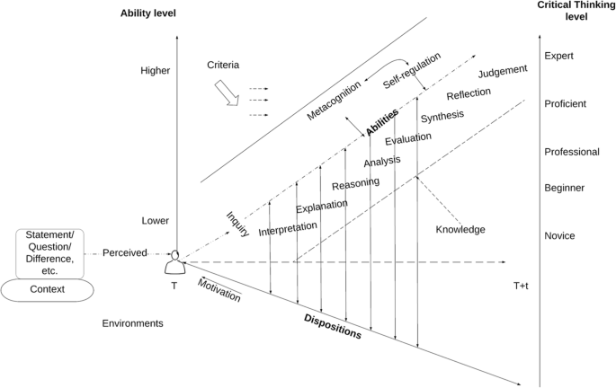

# Can AI be used for academic critical thinking? A preregistered example

Authors ([undecided list](https://github.com/richelbilderbeek/paper_critical_ai/issues/4))

- Richèl J.C. Bilderbeek
  
- Apu Ramesh 
  
- Johanna Söderström
  

## Abstract

AI does stuff.
Can it do the critical thinking as required by academia?
Here we test this on a known
[known how, I don't think discussions in a seminar
is enough to make that established] flawed paper,
where we steer it to reproduce the same plots
and draw its own conclusion, as well as confront
it with the conclusion of the paper.
We find that ..., meaning that AI ...

## Introduction

### AI is important

AI does stuff [reference].

### Critical thinking is important

Critical thinking is important.
It is mentioned commonly among
[21st century skills](https://en.wikipedia.org/wiki/21st_century_skills).

There are many definitions of critical thinking.
We use a definition that synergizes with the experiment presented in this
paper.
A common occurance in these definitions for critical thinking
is their inspiration from the stages of Bloom's taxonomy `[Bloom, 1956]`,
which are used in pedogagy to help formulate a teaching outcome
of the appropriate
level (e.g. `[Chandio et al., 2016; Rutkowski et al., 2010]`).

???- question "What are the 6 stages in Bloom's taxonomy?"

    - Knowledge
    - Comprehension
    - Application
    - Analysis
    - Synthesis
    - Evaluation

A definition inspired by Bloom's taxonomy fits our experiment well,
where we'll gradually 'educate' an AI, starting by providing
knowledge and asking for an evaluation at a later stage.

An example of such is a definition is the one given by `[Ennis, 2015]`,
which literatally uses 4 out of 6 stages of Blooms taxonomy: 
'Critical thinking is the intellectually disciplined process of actively and
skillfully conceptualizing, applying, analyzing, synthesizing, and/or
evaluating information gathered from, or generated by, observation,
experience, reflection, reasoning, or communication,
as a guide to belief and action.'.

Where the above definition shines in its simplicity and one-dimensionality,
it does not give guidelines on how to increase (or decrease)
the level of critical thinking.
For such guidelines, we found the framework of `[Spector & Ma, 2019]`
helpful to set up our experiment, even though it does not give a
quotable definition of critical thinking.

???- question "How does that framework look like?"

    Here is figure 1 from `[Spector & Ma, 2019]`:

    

The framework provides for 5 levels of critical thinking,
starting from novice as the lowest and expert
as the highest level.

???- question "What are those 5 levels?"

    - Novice
    - Beginner
    - Professional
    - Proficent
    - Expert

The higher levels of critical
thinking are achieved from both an increase in knowledge
and increasingly high ability to reason. 
Of these 8 abilities, 3 can be found literally in Blooms taxonomy.

???- question "What are those 8 abilities?"

    - Interpretation
    - Explanation
    - Reasoning
    - Analysis
    - Evaluation
    - Synthesis
    - Reflection
    - Judgement

This framework can be used as a guide to take any learner, such an AI,
to the highest level of critical thinking,
as we'll do in the experiment of this paper.

Additionally, `[Spector & Ma, 2019]` state that 
'The process of critical thinking requires the support
of corresponding internal indispositions such as open-mindedness and
truth-seeking'.
Seeking the truth is one of the goals of science
`[ref, ?UNESCO]`.
Would an AI be able to think critically, hence, it would
be able to (help) seek the truth, which is what we investigate
in this paper.

### Humans do critical thinking when discussing academic papers

Humans sometimes discuss academic papers.
During such an event, papers are examined critically.
During a TRÊS literature club of around 2018,
the paper `[Bolnick and Stutz, 2017]` was discussed.
This paper's conclusion was novel and has accumulated 72 citations
(as of on Google Scholar on 2025-04-18) of researches building upon this
paper's conclusion.
When the literature club looked closer at the data,
however, the conclusion of the paper was, however, judged to be
false by its participants.
The discussion of this paper and its perceived flaw
is discussed in the section 'The paper discussion'.

### Research question

The goal of this paper is to measure the level of critical
thinking of an AI in the context of an academic paper,
following the framework of `[Spector & Ma, 2019]`.
Assuming we can guide an AI to the highest level
of critical thinking, we determine how well it achieves
on the highest abilities (evaluation, synthesis, reflection and judgement)
needed to achieve this level.

To do so, we guide an AI to the highest level of critical thinking
on an academic paper, following the storyline of that paper.
First, we teach an AI the analysis of the paper and ask it to judge
if the analysis is sound. Will it be gullible or will it point out already
the same flaws that humans found?
Second, we teach the AI an alternative line of thought, to make
it re-evaluate the same analysis.
Will it be able to change its judgement from some indirect
hints from humans?

## Hypothesis

- H0: AI can be used for critical thinking

???- question "Why no H1?"

    As remarked by JMS, H1 'AI cannot be used for critical thinking'
    is missing. I (RJCB) think that adding H1 would be redundant.
    
    I would agree that, when there are more hypotheses,
    to start numbering hypotheses from one, e.g. H1 and onwards
    (i.e. don't start counting from zero)

    We can vote on whether H1 (as a complement to H0) should be added.

- [NEW] H1: AI will agree that using an absolute normalized body mass
  on the x-axis and a survival status on the y-axis is a
  good way to show that extreme body masses have a higher fitness
- [NEW] H2: AI will agree that using an relative normalized body mass
  on the x-axis and a survival status on the y-axis is a
  good way to show that extreme body masses have a higher fitness

## Methods

The preregistration can be found at
[https://osf.io/yxv4n](https://osf.io/yxv4n).

### Choice of AI

We picked an AI that can read data from files.
[I think we should test more than one AI if possible]

### Experiment

- Take a dataset and the code of a published paper which we are doubting
  the validity of
- D1. Ask an AI to read the dataset
- D2. Describe the dataset
- **Q0**: Describe the conclusion [Can AI distinguish what the conclusions are?]
- D4. Reproduce the results in that paper [multiple results?]
- **Q1**: Ask if the conclusion is correct
- D5 Reproduce the results that show a flaw in the reasoning
- **Q2**: Ask if the conclusion is correct

The exact dialogue can be found at [dialogue/README.md](dialogue/README.md).
Because this dialogue is written in mostly exact phrases, we
expect any AI to consistently draw a same conclusion,
as the dialog will be mostly the same.
To check this assumption, the experiment will be done three times,
to ensure our findings are robust.  

### Drawing conclusions

Per experiment, the conclusion is drawn according to this table:

<!-- markdownlint-disable MD013 --><!-- Tables cannot be split up over lines, hence will break 80 characters per line -->

Q1 |Q2 |Verdict
---|---|---------------------------------------
Yes|Yes|AI is not critical, H0 rejected
Yes|No |AI is critical, H0 accepted [not sure about the right conclusion here, need to think more]
No |Yes|AI is rebellious, experiment failed
No |No |AI is unexpectedly critical, H0 accepted

<!-- markdownlint-enable MD013 -->

As this experiment is done three times, we will show the frequency of
each conclusion:

<!-- markdownlint-disable MD013 --><!-- Tables cannot be split up over lines, hence will break 80 characters per line -->

Frequency|Verdict
---------|---------------------------------------
?        |AI is not critical, H0 rejected
?        |AI is critical, H0 accepted [not sure about the right conclusion here, need to think more]
?        |AI is rebellious, experiment failed
?        |AI is unexpectedly critical, H0 accepted

<!-- markdownlint-enable MD013 -->

## Conclusion

We found ...

This paper concludes that AI can/cannot be
used to critically think about an academic
paper.

## Discussion

Only 1 example,
due to limited amount of time invested.
We invite others to reproduce this experiment on
other papers.

Example was picked pseudo-randomly,
as this paper had already been analysed.
For future research, it would be interesting
to use papers known to have been fraudulent.

Only 1 AI, due to limited amount of time invested.
However, the dialogue can be fully reproduced
and we invite others to submit their results.

Only 1 point in time, but the dialogue can be fully reproduced.
Also here, we invite others to submit their results
at different points in time.

## References

- `[Bloom, 1956]`
  Bloom, Benjamin S., et al.
  Taxonomy of educational objectives:
  The classification of educational goals.
  Handbook 1: Cognitive domain. New York: Longman, 1956.

- `[Bolnick and Stutz, 2017]`
  [https://github.com/richelbilderbeek/Bolnick_and_Stutz_2017](https://github.com/richelbilderbeek/Bolnick_and_Stutz_2017)

- `[Chandio et al., 2016]`
  Chandio, Muhammad Tufail, Saima Murtaza Pandhiani, and Rabia Iqbal. 
  "Bloom's Taxonomy: Improving Assessment and Teaching-Learning Process." 
  Journal of education and educational development 3.2 (2016): 203-221.

- `[Davies & Barnett, 2015]`
  Davies, Martin, and Ronald Barnett, eds.
  The Palgrave handbook of critical thinking in higher education.
  Springer, 2015.

- `[Ennis, 2015]` Ennis, Robert H. 
  "Critical thinking: A streamlined conception."
  The Palgrave handbook of critical thinking in higher education.
  New York: Palgrave Macmillan US, 2015. 31-47.

- `[Rutkowski et al., 2010]`
  Rutkowski, Jerzy, et al. 
  "Application of Bloom’s taxonomy for
  increasing teaching efficiency–case study."
  Proc. of ICEE2010 (2010).

- `[Spector & Ma, 2019]`
  Spector, Jonathan Michael, and Shanshan Ma. 
  "Inquiry and critical thinking skills for the next generation:
  from artificial intelligence back to human intelligence."
  Smart Learning Environments 6.1 (2019): 1-11.

