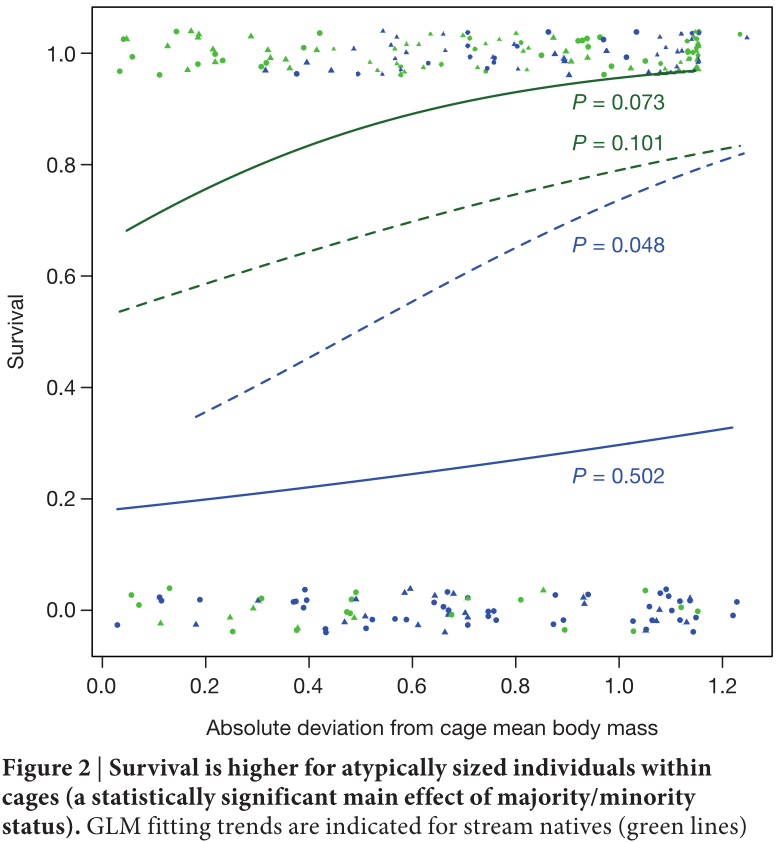
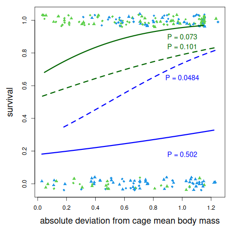
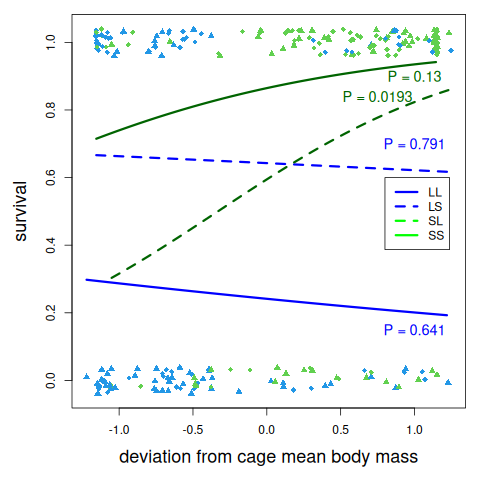

# The paper discussion

Details can be found at [https://github.com/richelbilderbeek/Bolnick_and_Stutz_2017](https://github.com/richelbilderbeek/Bolnick_and_Stutz_2017).

The conclusion of the paper is that extreme body sizes fare better.
This can be shown in a plot that uses the *absolute* of the relative
normalized body mass, as shown in plot versions A (from the paper)
and B (reproduced from data) below.

When taking just the relative
normalized body mass, this pattern breaks down,
as shown in plot version C shown below.

Instead, the conclusion should be:

- in the lake: smaller individuals thrive
- in the stream: bigger individuals thrive.

<!-- markdownlint-disable MD013 --><!-- Tables cannot be split up over lines, hence will break 80 characters per line -->

Version|Figure 2 version|Description
-------|---------------------------------------------------|---------------------------------------------------
A      |   |As in paper
B      |       |Reproduced using author's code
C      ||Reproduced using the real values

<!-- markdownlint-enable MD013 -->

Note that there is another flaw in the analysis,
that is not mentioned in the original paper,
which is the different amounts of fish in an enclosure.
The original paper describes three fish per enclosure.
In such a setting, it seems reasonable to normalize the body mass
of the fish within each enclosure.
However, in three enclosures (L6, L25, and S24),
only two fish were present. This will always result in
normalized body masses of `-0.707` and `+0.707` (i.e. the square root of
2 and its negative), regardless of the fish had very similar of
very different body masses. The effect of this is left unexplored,
as we think that using absolote values of body mass is the more
influential flaw in the original paper.

## References

- `[Bolnick & Stutz, 2017]` Bolnick, Daniel I., and William E. Stutz.
  "Frequency dependence limits divergent evolution by favouring rare
  immigrants over residents." Nature (2017).
